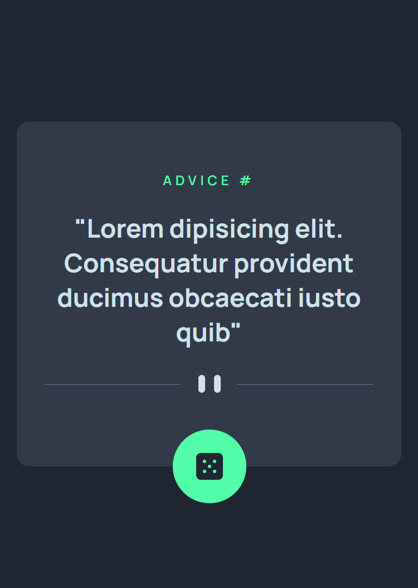
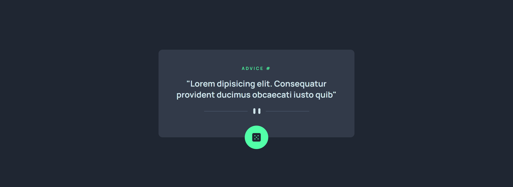

# Frontend Mentor - Advice generator app solution

This is a solution to the [Advice generator app challenge on Frontend Mentor](https://www.frontendmentor.io/challenges/advice-generator-app-QdUG-13db). Frontend Mentor challenges help you improve your coding skills by building realistic projects.

## Overview

### The challenge

Users should be able to:

- View the optimal layout for the app depending on their device's screen size
- See hover states for all interactive elements on the page
- Select and submit a number rating
- See the "Thank you" card state after submitting a rating

### Screenshot

Mobile:  

Desktop:  

### Links

- Solution URL: [https://github.com/BeltserG/challenges/tree/master/advice-generator-app-main](https://github.com/BeltserG/challenges/tree/master/advice-generator-app-main)
- Live Site URL: [https://beltserg.github.io/challenges/advice-generator-app-main/](https://beltserg.github.io/challenges/advice-generator-app-main/)

## My process

### Built with

- Semantic HTML5 markup
- CSS
- Flexbox
- Mobile-first workflow
- JavaScript fetch()
- API support

### Useful resources

[Advice API](https://api.adviceslip.com/)

## Author

- GitHub - [BeltserG](https://github.com/BeltserG)
- Frontend Mentor - [BeltserG](https://www.frontendmentor.io/profile/BeltserG)
- Email - beltsergeorgy@gmail.com

## Acknowledgments
