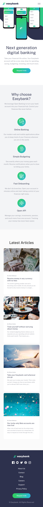
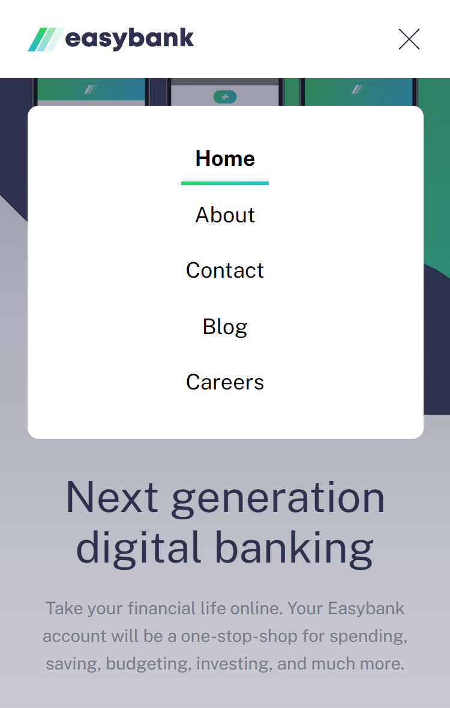
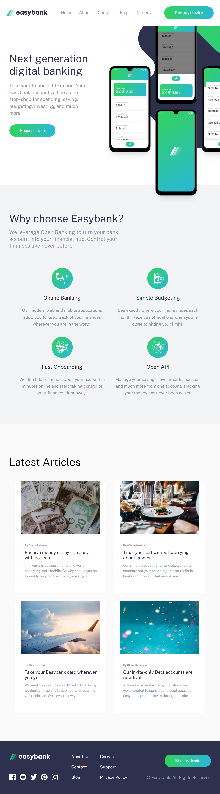
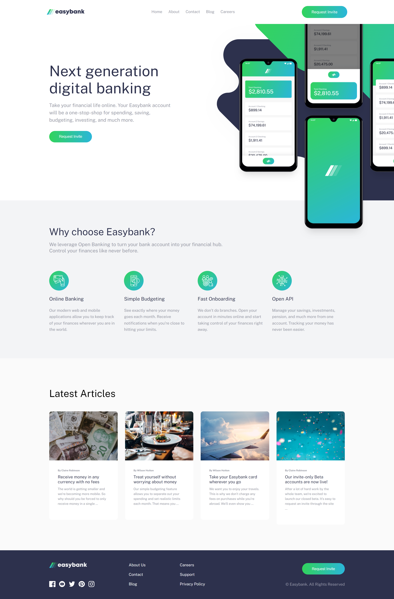

# Frontend Mentor - Easybank landing page solution

This is a solution to the [Easybank landing page challenge on Frontend Mentor](https://www.frontendmentor.io/challenges/easybank-landing-page-WaUhkoDN). Frontend Mentor challenges help you improve your coding skills by building realistic projects. 

## Table of contents

- [Overview](#overview)
  - [The challenge](#the-challenge)
  - [Screenshots](#screenshots)
  - [Links](#links)
- [My process](#my-process)
  - [Built with](#built-with)
- [Author](#author)

## Overview

### The challenge

Users should be able to:

- View the optimal layout for the site depending on their device's screen size
- See hover states for all interactive elements on the page

### Screenshots

Mobile:  

Mobile NavBar:  

Tablet:

Desktop:  

Cart Interaction:

### Links

- Solution URL: [https://github.com/BeltserG/challenges/tree/master/easybank-landing-page-master](https://github.com/BeltserG/challenges/tree/master/easybank-landing-page-master)
- Live Site URL: [https://beltserg.github.io/challenges/easybank-landing-page-master/](https://beltserg.github.io/challenges/easybank-landing-page-master)

## My process

### Built with

- Semantic HTML5 markup
- Responsive Web Design
- Mobile-first workflow

## Author

- GitHub - [BeltserG](https://github.com/BeltserG)
- Frontend Mentor - [BeltserG](https://www.frontendmentor.io/profile/BeltserG)
- Email - beltsergeorgy@gmail.com