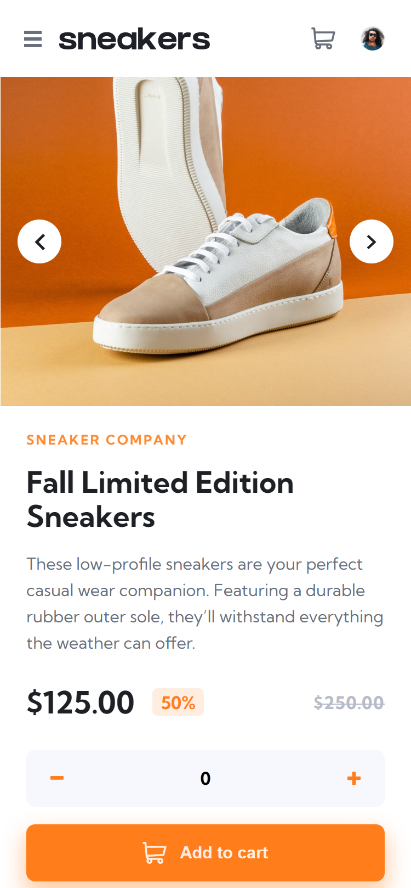
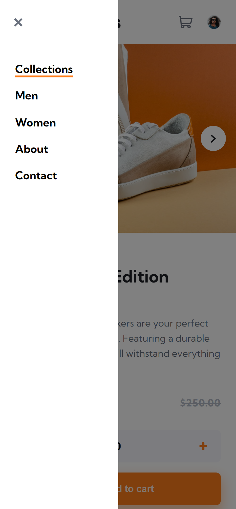
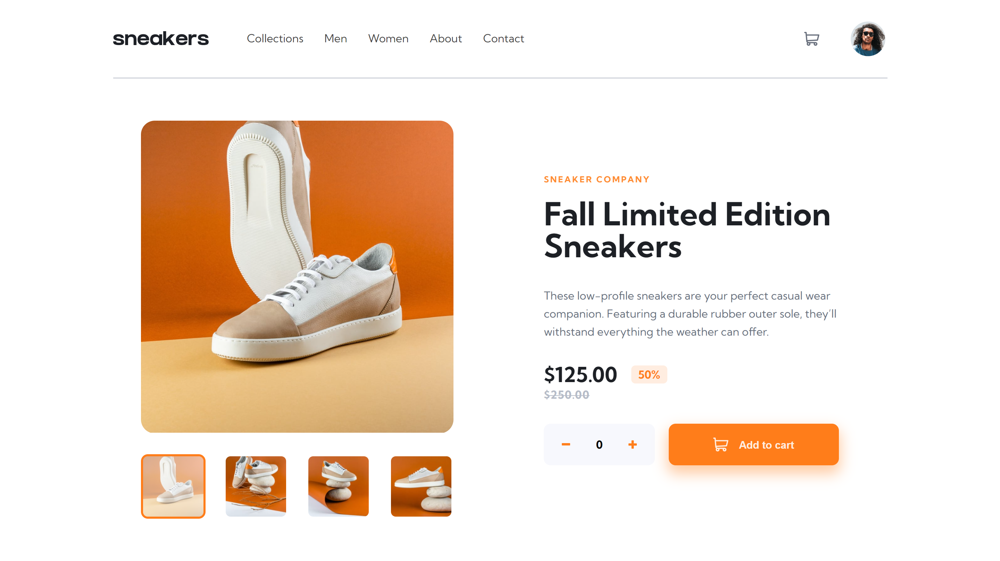
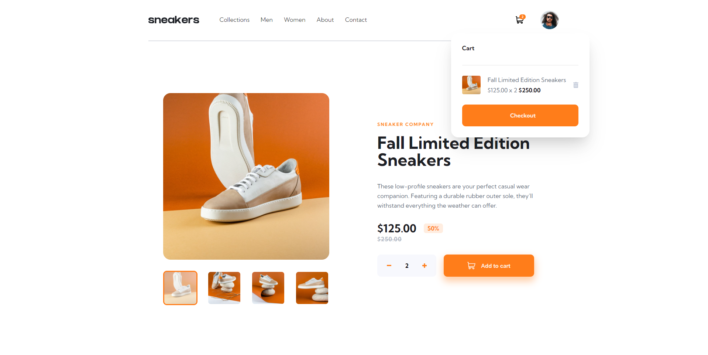

# Frontend Mentor - E-commerce product page

This is a solution to the [E-commerce product page challenge on Frontend Mentor](https://www.frontendmentor.io/challenges/ecommerce-product-page-UPsZ9MJp6). Frontend Mentor challenges help you improve your coding skills by building realistic projects.

- [Overview](#overview)
  - [The challenge](#the-challenge)
  - [Screenshots](#screenshots)
  - [Links](#links)
  - [Built with](#built-with)
- [Author](#author)

## Overview

Design and scripting for the e-commerce web-site product page.

### The challenge

Users should be able to:

&check;  View the optimal layout for the site depending on their device's screen size\
&check;  See hover states for all interactive elements on the page\
&check;  Open a lightbox gallery by clicking on the large product image\
&check;  Switch the large product image by clicking on the small thumbnail images\
&check;  Add items to the cart\
&check;  View the cart and remove items from it

### Screenshots
&nbsp;

Mobile:  

Mobile NavBar:  

Desktop:  

Cart Interaction:

### Links

- Solution URL: [https://github.com/BeltserG/challenges/tree/master/ecommerce-product-page-main](https://github.com/BeltserG/challenges/tree/master/ecommerce-product-page-main)
- Live Site URL: [https://beltserg.github.io/challenges/ecommerce-product-page-main/](https://beltserg.github.io/challenges/ecommerce-product-page-main)

### Built with

- Semantic HTML5 markup
- CSS
- Flexbox
- Mobile-first workflow
- JavaScript fetch(), functional programming
- Working with JSON data

## Author

- GitHub - [BeltserG](https://github.com/BeltserG)
- Frontend Mentor - [BeltserG](https://www.frontendmentor.io/profile/BeltserG)
- Email - beltsergeorgy@gmail.com