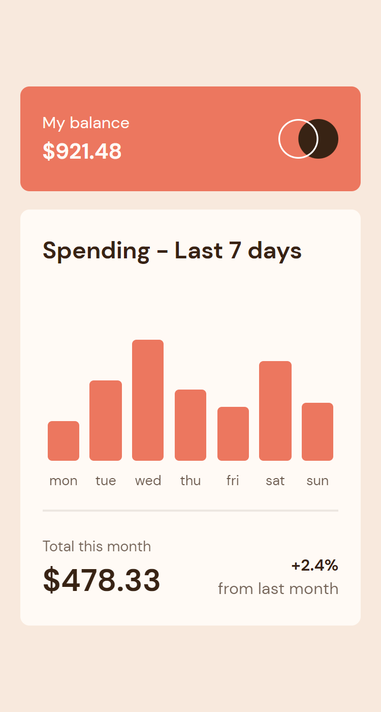

# Frontend Mentor - Expences Chart Component Main

This is a solution to the [Advice generator app challenge on Frontend Mentor](https://www.frontendmentor.io/challenges/advice-generator-app-QdUG-13db). Frontend Mentor challenges help you improve your coding skills by building realistic projects.

## Table of contents

- [Overview](#overview)
  - [The challenge](#the-challenge)
  - [Screenshot](#screenshot)
  - [Links](#links)
- [My process](#my-process)
  - [Built with](#built-with)
- [Author](#author)

## Overview

### The challenge

Users should be able to:

- View the bar chart and hover over the individual bars to see the correct amounts for each day
- See the current day’s bar highlighted in a different colour to the other bars
- View the optimal layout for the content depending on their device’s screen size
- See hover states for all interactive elements on the page
- **Bonus**: Use the JSON data file provided to dynamically size the bars on the chart

### Screenshot

Mobile:  

Desktop:  

### Links

- Solution URL: [https://github.com/BeltserG/challenges/tree/master/expenses-chart-component-main](https://github.com/BeltserG/challenges/tree/master/expenses-chart-component-main)
- Live Site URL: [https://beltserg.github.io/challenges/expenses-chart-component-main/](https://beltserg.github.io/challenges/expenses-chart-component-main/)

## My process

### Built with

- Semantic HTML5 markup
- CSS, SASS
- Flexbox
- Mobile-first workflow
- JavaScript fetch(), async/await, DOM manipulation

## Author

- GitHub - [BeltserG](https://github.com/BeltserG)
- Frontend Mentor - [BeltserG](https://www.frontendmentor.io/profile/BeltserG)
- Email - beltsergeorgy@gmail.com
