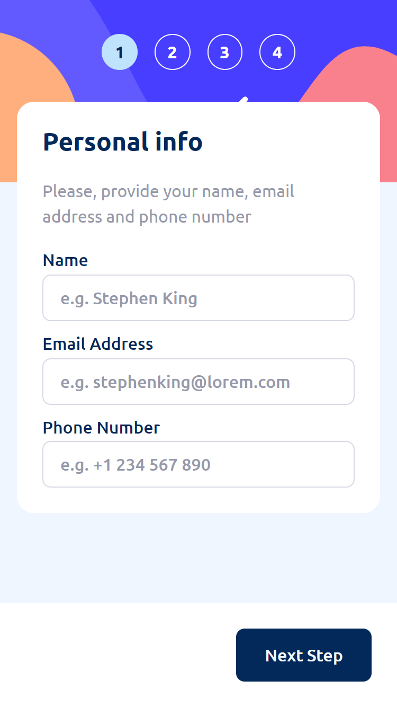
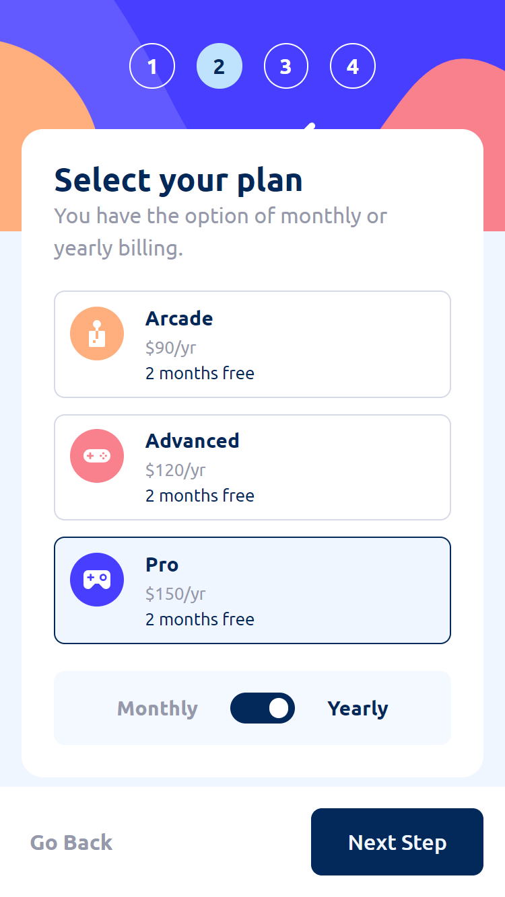
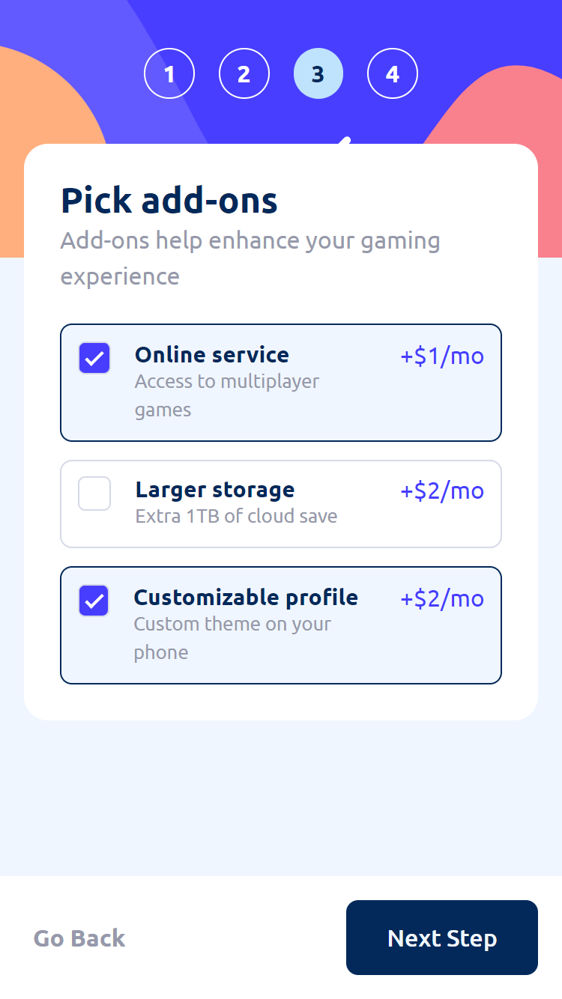
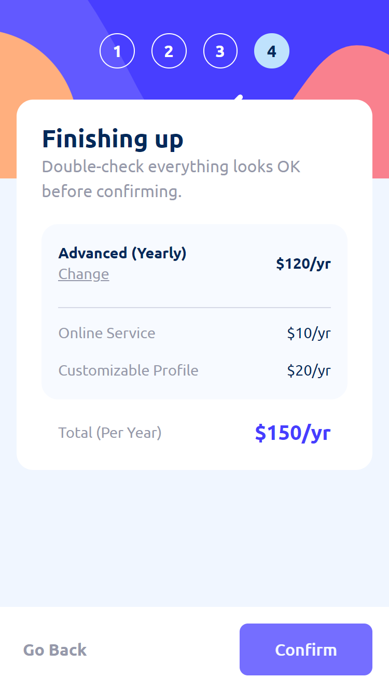
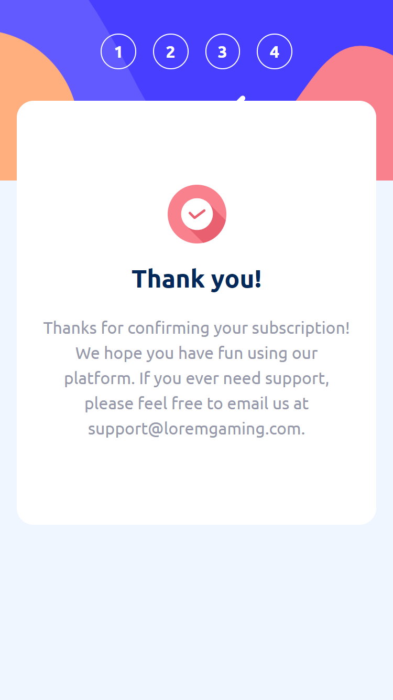
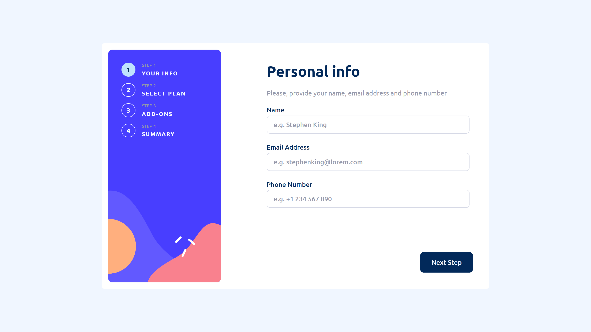
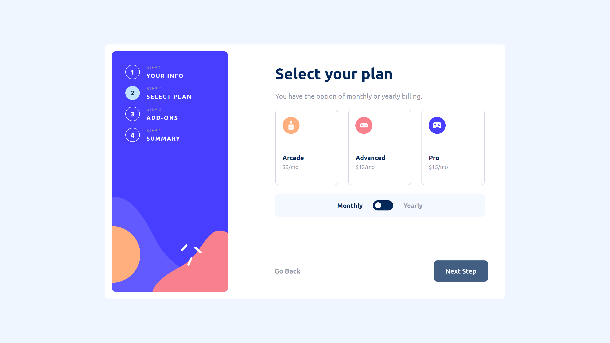
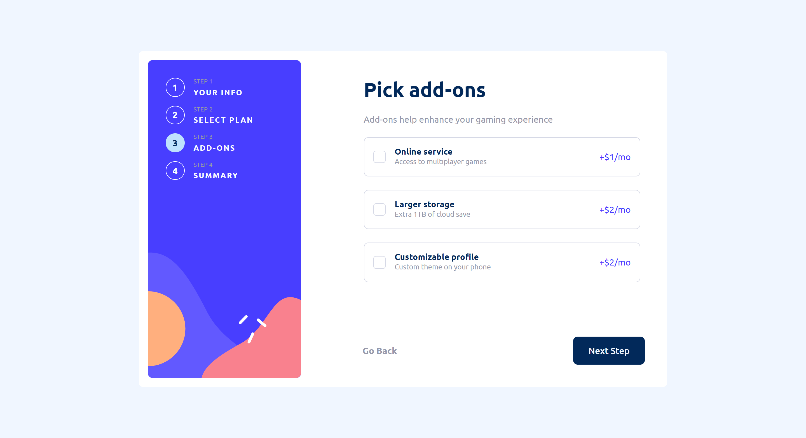
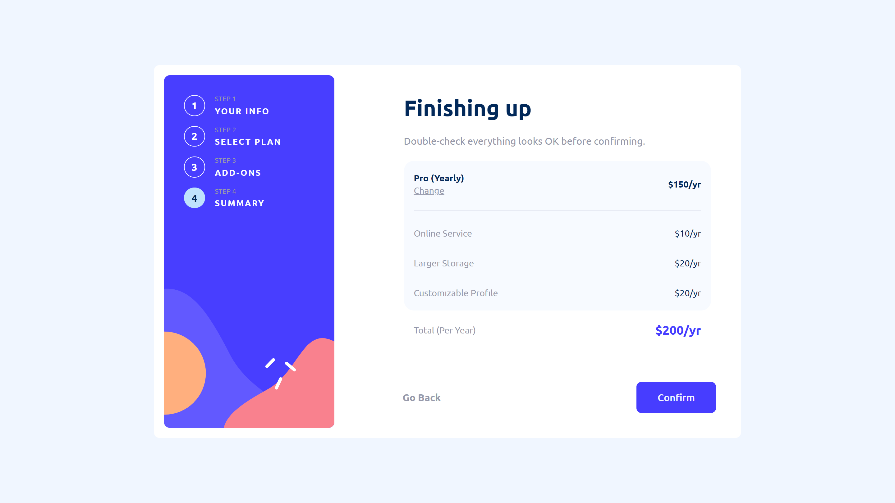

# Frontend Mentor - Multi-step form solution

This is a solution to the [Multi-step form challenge on Frontend Mentor](https://www.frontendmentor.io/challenges/multistep-form-YVAnSdqQBJ). Frontend Mentor challenges help you improve your coding skills by building realistic projects. 

## Table of contents

- [Overview](#overview)
  - [The challenge](#the-challenge)
  - [Screenshots](#screenshots)
  - [Links](#links)
- [Project details](#project-details)
  - [Built with](#built-with)
  - [What I learned](#what-i-learned)
  - [Continued development](#continued-development)
  - [Useful resources](#useful-resources)
- [Author](#author)
- [Acknowledgments](#acknowledgments)

## Overview

### The challenge

Users should be able to:

- Complete each step of the sequence
- Go back to a previous step to update their selections
- See a summary of their selections on the final step and confirm their order
- View the optimal layout for the interface depending on their device's screen size
- See hover and focus states for all interactive elements on the page
- Receive form validation messages if:
  - A field has been missed
  - The email address is not formatted correctly
  - A step is submitted, but no selection has been made

### Screenshots

#### Mobile View

  
  
  
  
  

#### Desktop view*

  

*active form steps You can watch in the [Desktop Active State View](./design_screenshots/Static/desktop/)

### Links

- Solution URL: [https://github.com/BeltserG/challenges/tree/master/multi-step-form-main](https://github.com/BeltserG/challenges/tree/master/multi-step-form-main)
- Live Site URL: [https://beltserg.github.io/challenges/multi-step-form-main/](https://beltserg.github.io/challenges/multi-step-form-main)

## Project details

### Description

Multi-step form is designed to be used for applying a subscription plan for the user.

Client cant see the current page with nav dots and numbers in the top(mobile) or the right(tablet and desktop) side. Client is able to take step back with "Go Back" button.

<strong>1st page</strong> collects data (name, email adddress, password).

Features:
- Email input have email-validation enabled, using RegEx
- User cannot proceed without all fields filled 

<strong>2nd page</strong> is for choosing the subscription plan.

Features:
- User can choose only one subscription plan
- User can toggle monthly/yearly payment plan
- If he chooses yearly, he will see the discount ammount in months
- User cannot proceed without choosing an option

<strong>3rd page</strong> prompts client to take additional services.

Features:
- User can choose  multiple add-ons
- User can proceed without chossing any options

<strong>4th page</strong> is showing chosen plan, add-ons and total ammount before cashout.

Features:
- With clicking "Change", user will be redirected to the second page
- "Next" button changes to "Confirm"

### Built with
- Semantic HTML5 markup
- CSS, SaSS preprocessing
- Mobile-first workflow
- Responsive Web Design principles
- Vanilla JavaScript

### Continued development
- Redesigning with React library
- Optimization with S.O.L.I.D principles
- Adding tests

## Author
- GitHub - [BeltserG](https://github.com/BeltserG)
- Frontend Mentor - [BeltserG](https://www.frontendmentor.io/profile/BeltserG)
- Email - beltsergeorgy@gmail.com